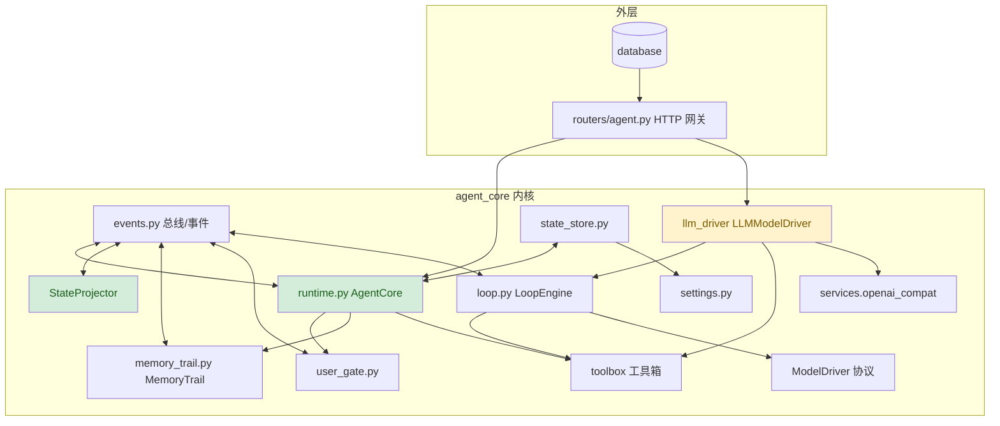

# Monstera Agent 内核地基体检报告

**审计日期：** 2026-09-01
**审计模式：** Architecture Audit（架构审计）
**审计范围：** `backend/agent_core/*`（events / loop / runtime / state_store / toolbox / user_gate / llm_driver / memory_trail / settings）+ 路由网关 `routers/agent.py`
**健康分：** 82 / 100

---

## 总体结论

这是一个纪律严明、铁律执行到位的地基。核心架构（事件总线 + 投影式状态机 + 双协议循环）没有结构性硬伤，无 Critical 缺陷；主要代价是「自由字典事件契约」与「状态迁移双路径」带来的隐性变更半径。

核心事实：循环引擎不碰状态存储、投影器是唯一状态机维护者、消费者强制携带 task_id（铁律被忠实执行）；`_p5_smoke.py` 11 项与 `_p6_features_smoke.py` 全过，崩溃恢复 / 硬保护 / 终态不变量均有测试兜底。

---

## Module Dependency Graph



依赖方向整体单向（内核 → 总线/协议，外层 → 内核接口），无循环 import，无分层倒挂。

---

## Findings

### Critical

无。

### Warning

**1. Change Propagation — 事件契约是无类型的自由字典，一次改名辐射四个消费方**

- **Symptom:** 事件 payload 全部是自由 `dict`。`loop.py` 发出 `{"tool", "args", "success", "data", "error"}`，随后 `StateProjector._on_tool_result_received`、`MemoryTrail._track`、`routers/agent.py._task_snapshot` 以及前端 `index.html` 的事件流渲染各自独立地按猜测解包这些字段。
- **Source:** A Philosophy of Software Design — Ch. 5: Information Hiding and Leakage；Refactoring — Shotgun Surgery
- **Consequence:** 一处事件 schema 变更需同时改 loop 发出方、投影器、记忆提炼器、SSE 快照、前端四层，回归面大且无编译期兜底；这是当前地基最大的隐性变更传播点。
- **Remedy:** 给高频事件（TOOL_CALL_REQUESTED / TOOL_RESULT_RECEIVED / OBSERVATION_READY）建立轻量 TypedDict 约束 + 集中 payload 构造/校验器（放 events.py），四层共用；至少先把字段名常量化为枚举。

**2. Domain Model Distortion — 状态迁移存在两条路径，状态机「唯一维护者」被局部穿透**

- **Symptom:** `StateProjector` 是声明的唯一状态机维护者，但 `runtime.py` 有两处绕开投影器直接调用 `store.set_status(...)`：`_plan_confirm` 拒绝时直设 FAILED（L226）、`restore()` 对中断任务直设 FAILED（L293）。
- **Source:** Working Effectively with Legacy Code — Seam 一致性；Software Engineering at Google — 单一事实源
- **Consequence:** 状态迁移事实分散两处，新增终态语义时容易只改投影器、漏掉 runtime 直设点，产生「合法迁移但状态机表里没有」的隐蔽不一致。
- **Remedy:** 将这两个场景改为先发布 `TASK_FAILED` 事件再由投影器落状态（Plan 拒绝 = 发 FAILED 事件 + 抛 409），把显式 set_status 收窄到只由投影器触发；或至少在 StateStore 侧加 transition_log 审计谁触发迁移。

**3. Cognitive Overload — LoopEngine.run 是 120 行单函数，多阶段逻辑线性堆叠**

- **Symptom:** `loop.py` 的 `run()` 约 120 行，混合停止事件检查、轮次防护、模型决策、非法决策防护、工具防护、用户闸、超时线程执行、事件发布、观察构建；嵌套达 4 层。
- **Source:** Refactoring — Long Method；Code Complete — Ch. 7: High-Quality Routines
- **Consequence:** 循环引擎是内核心脏，后续任何改动（暂停、新阶段）都要在 120 行里定位插入点，审读成本高、易碰坏既有路径。
- **Remedy:** 拆出阶段方法 `_maybe_stop / _guard_check / _decide / _gate_or_execute / _observe`，`run()` 只保留编排骨架，保持现事件顺序与单步返回语义。

### Suggestion

**4. Dependency Disorder — llm_driver 位于内核却直接 import 基础设施 services.openai_compat**

- **Symptom:** `LLMModelDriver` 是 `ModelDriver` 协议实现，安家 agent_core 并 import `services.openai_compat`。
- **Source:** Clean Architecture — 依赖规则
- **Consequence:** 内核与 LLM 厂商 SDK 的耦合藏在包里；当前因 loop 只认协议、驱动由路由层构造，危害有限。
- **Remedy:** 可维持现状（单用户本地、协议分界已生效）；如求整洁，将 llm_driver 上移为适配器目录，内核只留协议。

**5. Accidental Complexity — 生产入口内滞留演示脚手架**

- **Symptom:** `run_task()` 默认分支仍走 `ScriptedFakeModel + FakeToolbox`（Phase 0 空循环演示），真实路径靠 `model is not None` 切换。
- **Source:** The Mythical Man-Month；Refactoring — 不可删除的脚手架
- **Consequence:** 主流程多三路分支，执行语义取决于调用方传参，需区分演示与生产。
- **Remedy:** 将 fake 路径收敛为验收脚本 import 的测试夹具（tests 目录），生产入口只留真实 / plan 两条。

**6. Knowledge Duplication — 前端状态标签映射与后端枚举各自副本**

- **Symptom:** 前端 `statusLabel` / `TASK_ICONS` 独立维护一份状态中文映射；后端 `TaskStatus` 枚举是另一份。
- **Source:** Refactoring — Shotgun Surgery（跨层副本）；The Pragmatic Programmer — DRY
- **Consequence:** 新增状态时前端容易漏改，出现「后端成功、前端显示未知」。
- **Remedy:** 后端给状态元数据接口，或前端集中常量并注释「与 TaskStatus 对齐」。

---

## Summary

核心架构健康：事件总线的「铁律」被忠实执行（循环引擎不碰存储、投影器唯一落状态、消费者强制携带 task_id），协议化让模型与工具可独立替换。最重要的改善方向是给事件契约上类型约束（收敛最大变更半径）与收敛状态迁移入口（保全「唯一维护者」的说法）；两者均为低风险小手术，不触碰地基结构。策略正确、细节待打磨——先止血后镀金。

---

# 附：运行逻辑与设计哲学

## 一、一次任务的完整生命周期（数据流）

```
用户输入目标
   │  POST /api/agent/tasks {objective}
   ▼
AgentCore.create_task()
   ├─ StateStore.create_task  → TaskState{status=idle} + 快照落盘
   ├─ StateProjector.attach(task_id)   ← 订阅事件，负责状态投影
   └─ MemoryTrail.attach(task_id)      ← 订阅事件，负责记忆提炼
   │
   ▼
POST /api/agent/tasks/{id}/run   （前端同时开 SSE /tasks/{id}/stream）
   │
   ▼
LoopEngine.run(objective, model, executor, gate, stop_event)
   │  重复以下循环（每轮迭代）
   ├─ ① 停止事件检查 + ② 轮次硬保护（max_iterations）
   ├─ ③ STEP_STARTED 事件 ──────────────► 总线
   ├─ ④ model.decide(objective, history) → ModelDecision
   │      ├─ final_answer ──► TASK_COMPLETED ──► 完成
   │      └─ tool_call ──► ⑤ 工具调用计数硬保护
   ├─ ⑥ UserGate.guard()：风险分级
   │      ├─ ALLOW/NOTIFY → 放行
   │      └─ CONFIRM → HUMAN_INTERVENTION_REQUIRED → 阻塞等用户 → 允许/拒绝
   ├─ ⑦ 执行工具（daemon 线程 + step_timeout_s 超时观察）
   ├─ ⑧ TOOL_RESULT_RECEIVED 事件 → 构建 Observation → 追加 history → 回到 ④
   └─ ⑨ 硬保护触发 / 模型错误 / 用户停止 → TASK_FAILED
   │
   ▼
事件流途经总线，两条平级消费者各自投影（互不直接调用）：
   ├─ StateProjector：完成状态迁移 + 机械计数 + 创建文件集合（覆盖分级依据）
   └─ MemoryTrail   ：任务终态时提炼原子记忆 → memory.jsonl
前端经 SSE 收到快照帧逐帧渲染（右侧执行面板事件流 + 中间步骤时间线）
```

## 二、三层「哲学」（设计定稿 v1.0 的地基意志）

**1. 通信哲学：任何两层之间禁止直接函数调用，一切经事件总线（铁律）。**

循环引擎不感知状态存储、不感知工具语义——它只发布事件并等待下一次决策。状态长得怎样、用户弹窗确认了什么、历史要不要沉淀，都由独立的订阅者决定。这让循环引擎成为纯决策器：可移植、可测试、可替换（协议化 ModelDriver / ToolExecutor 是同一哲学在横切面的体现：只用接口决策，不用实现流汗）。

**2. 状态哲学：状态是一个投影，不是一份内存。**

任务状态不是被几条 if 改出来的变量，而是事件流在 StateProjector 里的投影。状态机只允许沿 ALLOWED_TRANSITIONS 正向迁移（idle→executing→(waiting_human→)completed/failed），终态永不回跑；重试=新建同目标任务，宁造新纸，不改旧史。这保证可回放、可恢复、可审计——重启后从磁盘重建投影，中断的任务不会虚假卡在执行态。

**3. 安全哲学：机械硬保护与模型无关，信任但不盲信。**

轮次上限、工具调用上限、单步超时是引擎级硬闸，不依赖模型自觉；用户闸（CONFIRM）把危险操作挡在人眼面前，拒绝不终止任务而是换方案继续。Phase 5 补上的成本感知、Plan 确认、崩溃恢复，Phase 6 的记忆与上下文压缩，都是在「信任模型，但给它一堵墙」的哲学上继续加瓦——让循环廉价、让决策清醒。

## 三、当前地基的已知取舍

| 取舍 | 当前选择 | 代价 |
|---|---|---|
| 事件 payload | 自由 dict（无类型） | 变更半径大（Warning 1）——最重要的待办 |
| 状态迁移 | 投影器为主 + 2 处直设 | 「唯一维护者」说法被局部穿透（Warning 2） |
| 演示脚手架 | 留在 run_task 主入口 | 生产/演示意图混读（Suggestion 5） |
| 记忆存储 | JSON 行式文件 | 无索引、仅 2-gram 检索——够用但非工程级 |
| LLM 驱动归属 | 内核内 import services | 依赖方向轻微不纯（Suggestion 4） |

---

*报告生成：Brooks-Lint Architecture Audit，2026-09-01。*