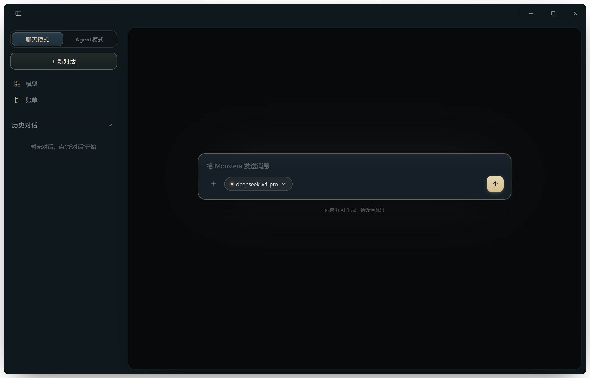
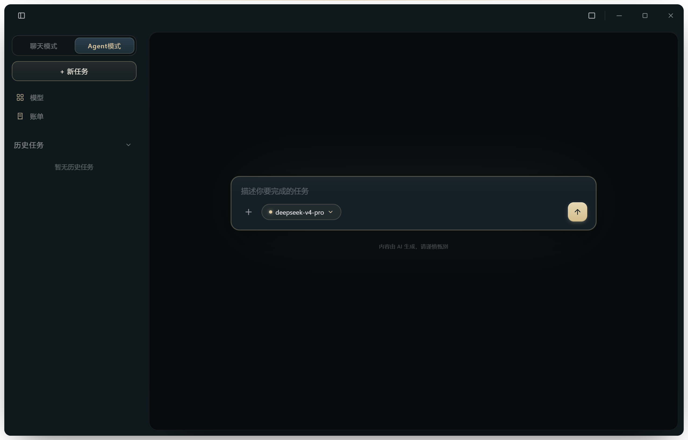
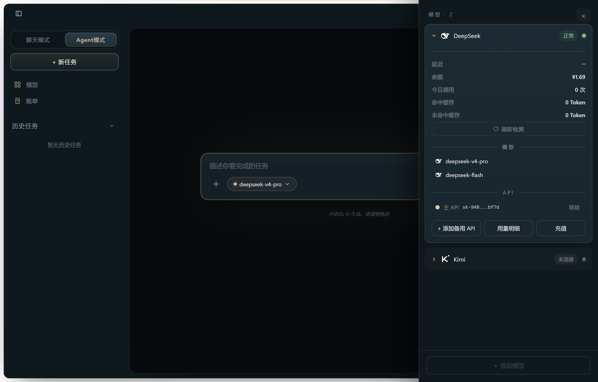

# Monstera

> Local-first, desktop-first AI app powered by an event-bus Agent kernel. Chat with multiple LLM providers (OpenAI-compatible APIs & ollama local models), run Agent tasks with a mechanical-guarded tool loop, and keep every key encrypted with Fernet on your own machine. Built with FastAPI + vanilla HTML/CSS/JS (no build step) + optional Electron shell. English-friendly; see [LOCAL_MODEL.md](LOCAL_MODEL.md) for local inference and [features](#界面预览) below.

多模型对话与 Agent 任务控制台 —— 本地单机的 AI 模型管理应用（桌面优先，Windows）。

内置一个事件总线驱动的 Agent 内核：把目标拆解成可执行计划，经模型驱动 + 工具执行器循环运转，全程机械硬保护（轮次上限 / 工具调用上限 / 单步超时），状态持久化到本地。

## 功能

- **聊天模式 / Agent 模式**：双模式切换，同一套消息流渲染
- **多厂商模型**：内置多家大模型 API 接入，密钥仅存后端（Fernet 加密落库，前端只看掩码）
- **长文本自动整理**：≥500 字的消息自动整理为 TXT 文档卡片，点击卡片弹出全文查看
- **对话记忆**：对话自动摘要并沉淀为 `memory/conv_*.md`（本地主权文档，不入库）
- **本地模型可选**：支持 llama.cpp 系本地推理（见 `LOCAL_MODEL.md`）
- **Agent 内核**：事件总线 / 状态机 / 用户闸 / 记忆轨迹 / 崩溃恢复，含 0-7 阶段确定性回归脚本

## 界面预览

| 聊天模式 | Agent 任务模式 | 模型管理 |
|---|---|---|
|  |  |  |

## 快速开始

要求：Python 3.10+，Windows 为本项目主平台。

```bash
cd backend
pip install -r backend/requirements.txt
python launcher.py          # 等价于 uvicorn main:app --port 8765
```

终端启动后，浏览器打开 `index.html`（或运行 `desktop/` 的桌面壳）即可使用。

前端为原生 HTML/CSS/JS（无构建步骤），后端为 FastAPI 单进程服务。

## 配置

环境变量写入 `backend/.env`（模板见 `backend/.env.example`）：

| 变量 | 说明 |
|---|---|
| `MONSTERA_ENCRYPTION_KEY` | Fernet 密钥（可选，缺省时自动生成 `.key` 于 `backend/`） |
| `MONSTERA_MOCK` | `1` 开启 Mock 模式（不消耗真实 API 额度，用于开发/回归） |

模型 API Key 在应用内「模型」面板配置，前端仅显示掩码。

## 安全模型与边界

- 服务**仅绑定 `127.0.0.1`**，CORS 仅放行 `file://` 来源。
- 本项目定位为**本地单用户桌面工具**，后端接口未内置网络鉴权——请勿将端口暴露到公网 / 局域网，也不要在多用户共享主机上运行。
- 依赖锁定：`requirements.txt` 当前未锁定精确版本，正式部署建议 `pip freeze > requirements.lock` 复现环境。
- 并发约束：后端按**单 worker** 运行；多 worker 会破坏进程内事件总线与索引一致性。

## 目录结构

```
Monstera/
├── index.html              前端入口（原生 HTML/CSS/JS + Alpine）
├── css/_style.css          全局样式
├── js/                     前端逻辑（ch10/ch15/ch16-legacy）
├── backend/
│   ├── main.py             FastAPI 入口
│   ├── agent_core/         事件总线 Agent 内核（冻结契约见 docs/agent-core-frozen-v1.md）
│   ├── routers/            路由层
│   ├── services/           模型客户端 / 记忆中枢 / 加密
│   ├── *_smoke.py          0-7 阶段确定性回归脚本
│   └── requirements.txt
├── desktop/            Electron 桌面壳（可选）
└── docs/               文档（LOCAL_MODEL.md / 审查报告等）
```

## 回归测试

内核与功能验证脚本不依赖真实网络/密钥（Mock 模式运行）：

```bash
cd backend
python _p7_acceptance.py    # 内核验收
python _p6_features_smoke.py
python _p5_smoke.py
```

## License

[MIT](LICENSE)